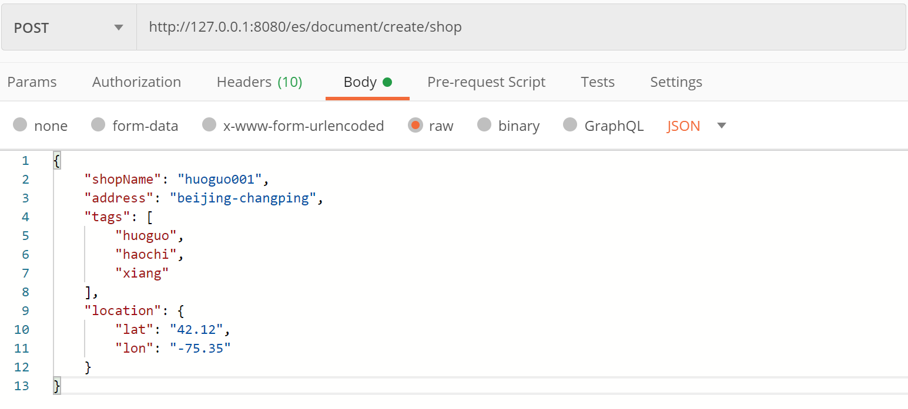
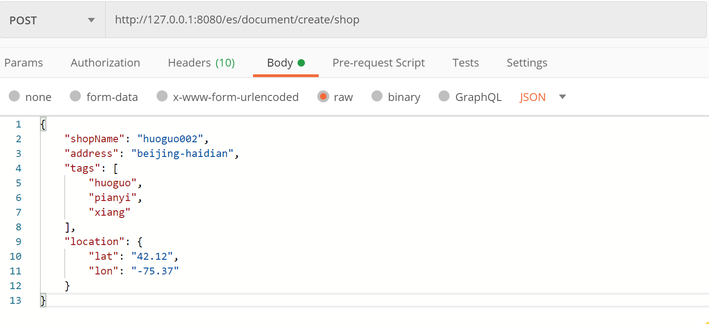
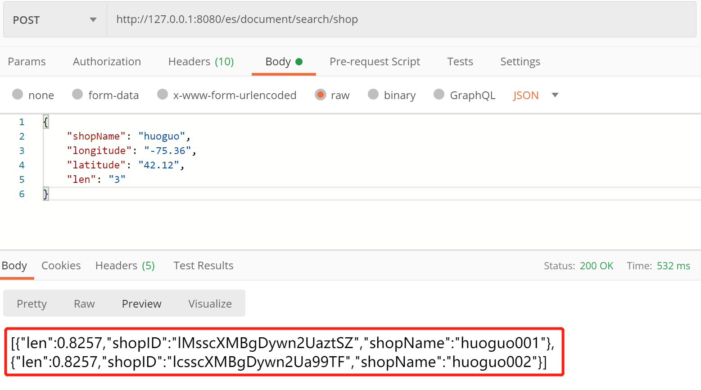
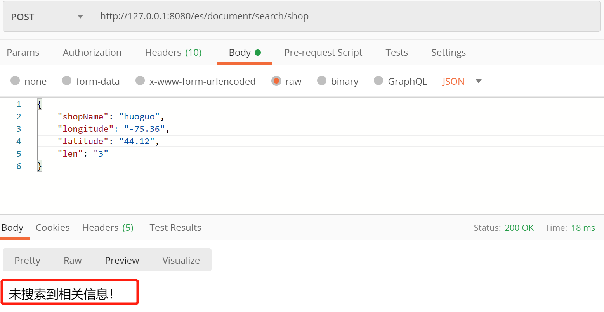

# 一、Spring Boot整合Elasticsearch介绍

&emsp;&emsp;Spring Boot整合Elasticsearch，实现商铺基于搜索建议、GEO位置搜索，具体实现思路和细节请参考:

> [Spring Boot整合Elasticsearch](https://www.jianshu.com/p/3582675704e1)

- Elasticsearch基本介绍
- Elasticsearch、Elasticsearch、Ik、Kibana环境搭建
- 实现商铺基于搜索建议、GEO位置搜索  

# 二、前期准备

## 2.1 环境搭建:

&emsp;&emsp;Elasticsearch、Elasticsearch、Ik、Kibana环境搭建参考：

> [Spring Boot整合Elasticsearch](https://www.jianshu.com/p/3582675704e1)

## 2.2 PostMan测试工具准备:

- [下载地址](https://www.postman.com/)

# 三、测试信息

&emsp;&emsp;新增店铺文档一请求：

&emsp;&emsp;新增店铺文档二请求：

&emsp;&emsp;店铺搜索请求成功：

&emsp;&emsp;店铺搜索请求失败：

